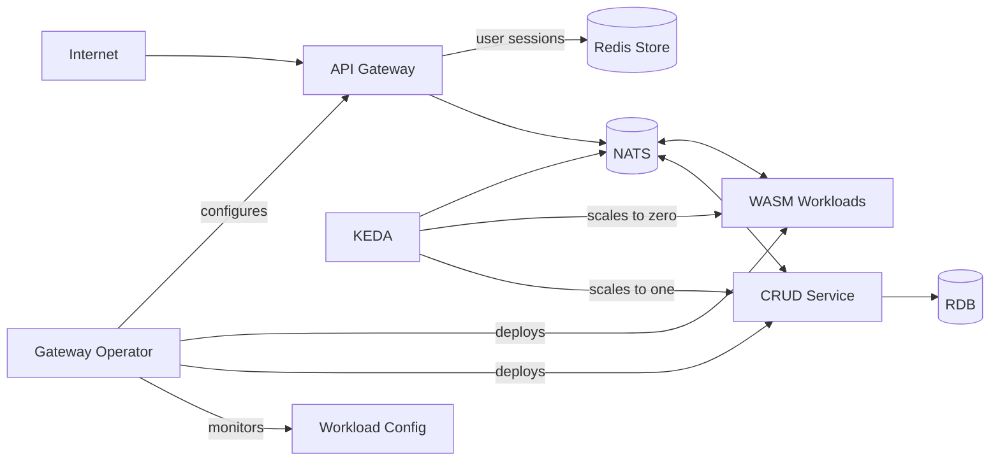

# wasm-stream
trying out wasm-based workloads with an event-based interface for responding to HTTP requests

## System Design

```mermaid
graph LR;
  internet["Internet"]
  api["API Gateway"]
  operator["Gateway Operator"]
  redis[(Redis Store)]
  nats[(NATS)]
  worker["WASM Workloads"]
  keda["KEDA"]
  config["Workload Config"]
  crud["CRUD Service"]
  rdb[(RDB)]

  internet-->api
  api--"user sessions"-->redis
  api-->nats
  nats<-->worker
  keda-->nats
  keda--"scales to zero"-->worker
  keda--"scales to one"-->crud
  operator--configures-->api
  operator--deploys-->worker
  operator--deploys-->crud
  operator--monitors-->config
  nats<-->crud
  crud-->rdb
```
